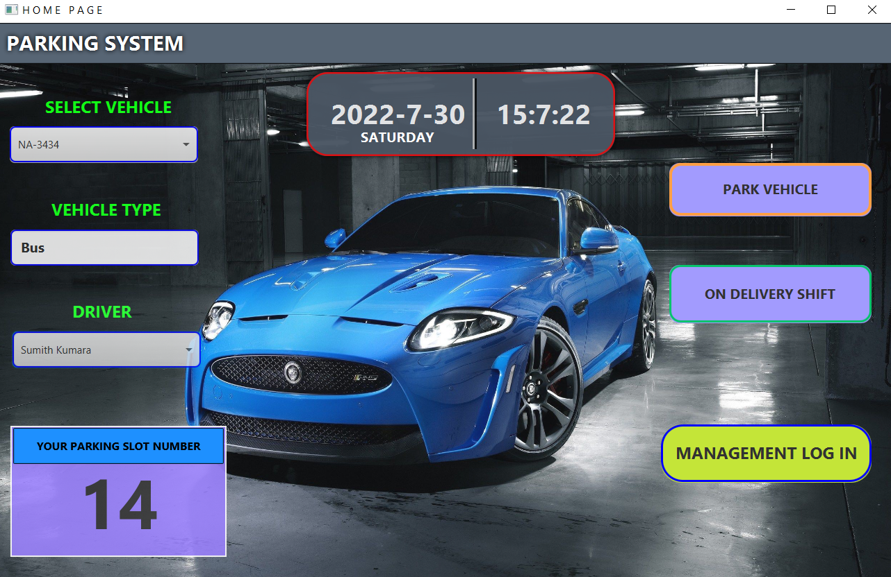
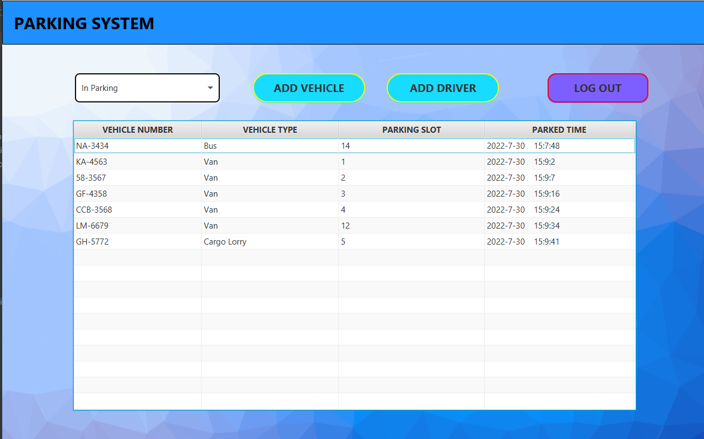
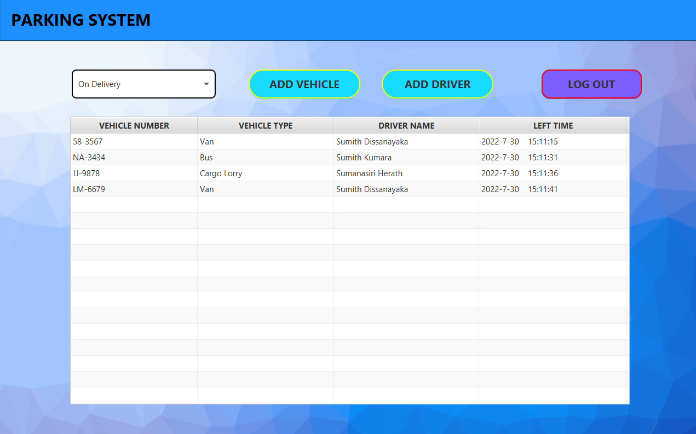
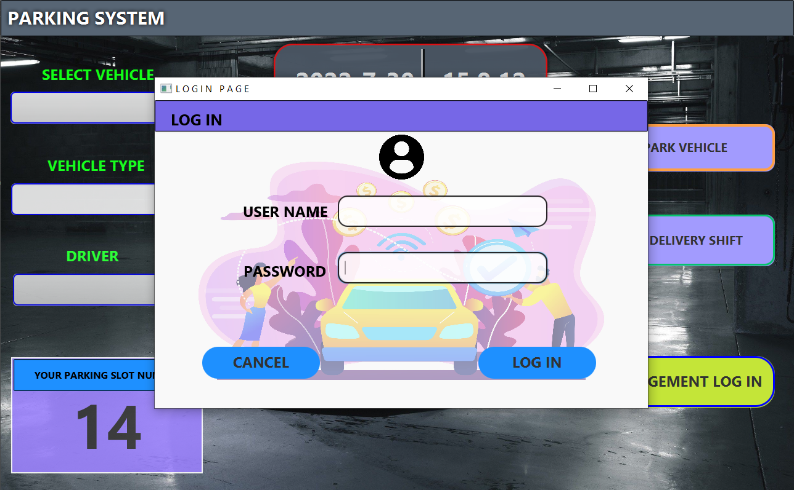
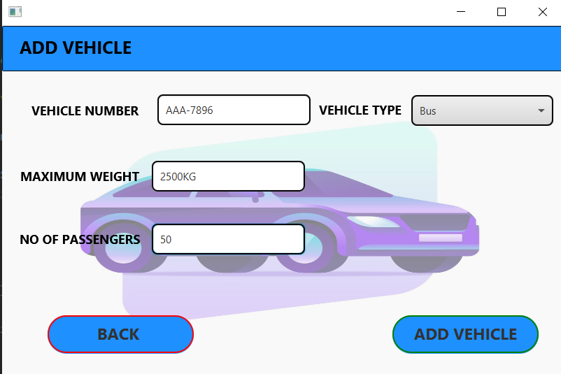
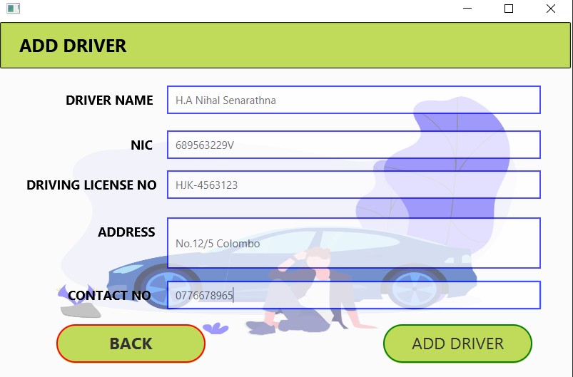

# Vehicle-Parking-System
Introduced a software Solution for systematically park  and management of vehicles

## Description

#### This Application is single Alone Application.And this Application developed for solving some problems of systematically park  and management of vehicles.

## Main Functions of Application
* Home Interface
* In Parking Vehicles Interface
* On Delivery Vehicles Interface
* Management Login Interface
* Add Vehicle Interface
* Add Driver Interface

#### Also,This Application Optimized to Provide for Desktop Devices.

## :link: Basic Background of Application

### 🌱 Home Interface

### 🌱 In Parking Vehicles Interface

### 🌱 On Delivery Vehicles Interface

### 🌱 Management Login Interface

### 🌱 Add Vehicle Interface

### 🌱Add Driver Interface

## Technology/Framework used
* javaFX
* Java
* CSS

## License
**Copyright @ 2022 All Right Reserved By Ishara Maduranga**
